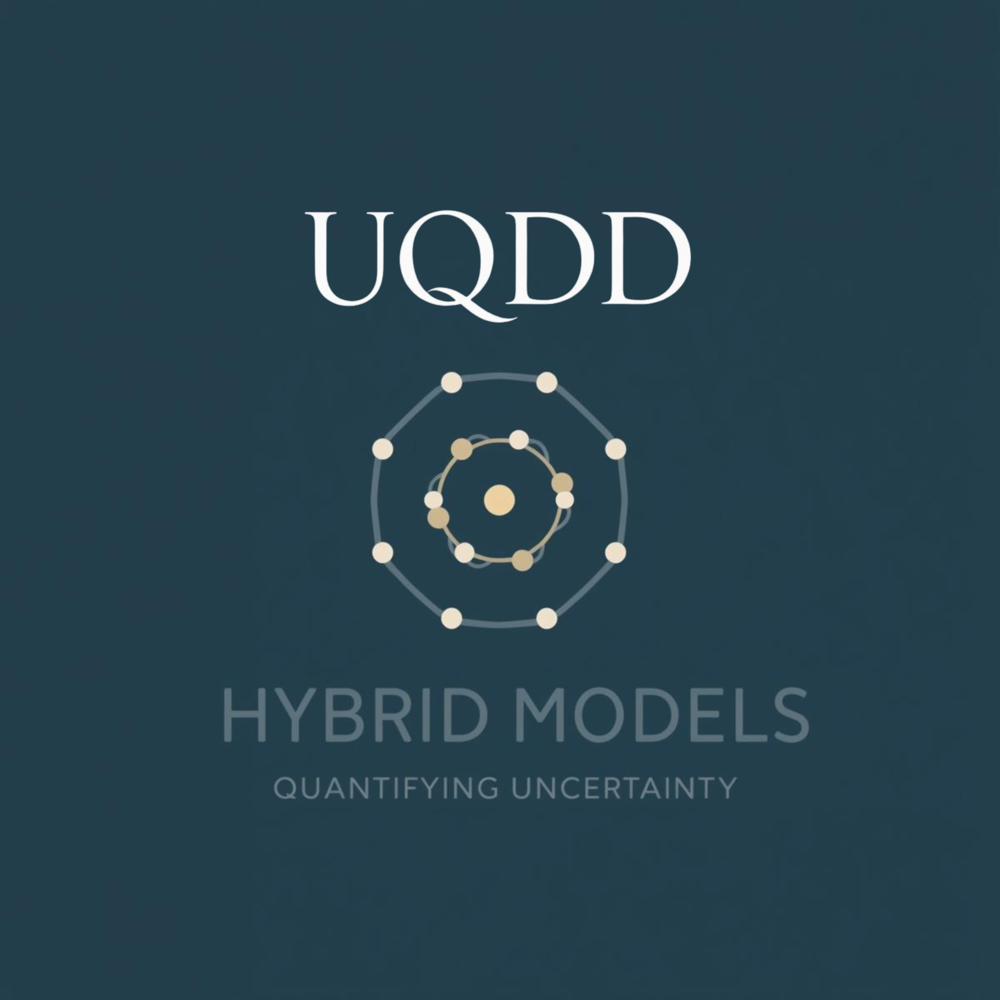
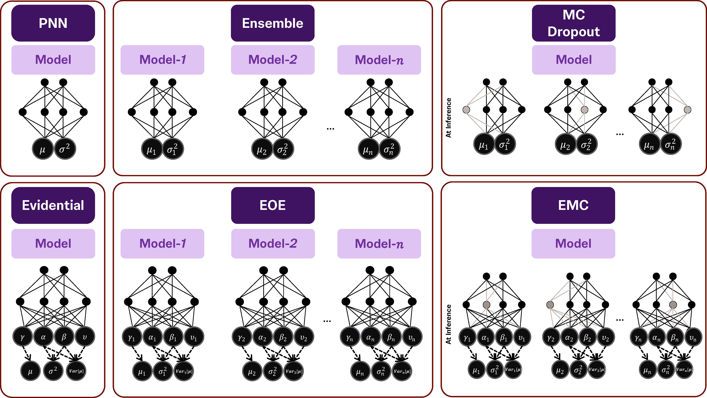
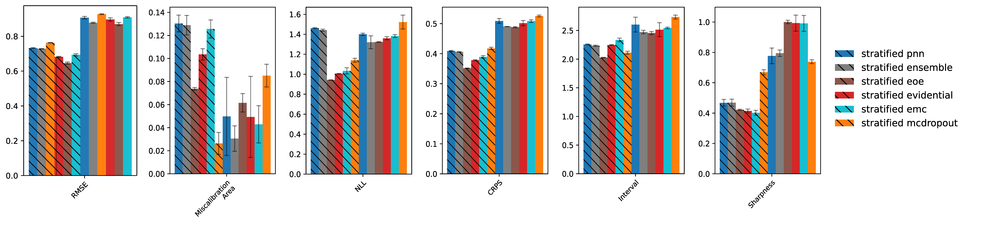
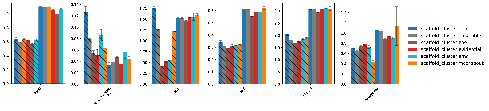

<a id="readme-top"></a>

<p align="center">
  
</p>

# Hybrid Uncertainty Quantification for Bioactivity Assessment

[Paper] Combining Bayesian and Evidential Uncertainty Quantification for Improved Bioactivity Modeling — https://pubs.acs.org/doi/10.1021/acs.jcim.5c01597


[](https://www.python.org/downloads/)
[](https://pytorch.org/get-started/locally/)
[](https://wandb.ai/site)

[//]: # ([![arxiv]&#40;https://img.shields.io/badge/Preprint-arXiv:123123&#41;]&#40;https://arxiv.org/&#41; )


<!-- TABLE OF CONTENTS -->
<details>
  <summary>Table of Contents</summary>
  <ol>
    <li>
      <a href="#about-the-project">About The Project</a>
    </li>
    <li>
      <a href="#getting-started">Getting Started</a>
      <ul>
        <li><a href="#prerequisites">Prerequisites</a></li>
        <li><a href="#installation">Installation</a></li>
        <li><a href="#folder-structure">Folder Structure</a></li>
      </ul>
    </li>
    <li>
        <a href="#usage">Usage</a>
        <ul>
            <li><a href="#dataprocessing">Data Processing</a></li>
            <li><a href="#model-architectures">Model Architectures</a></li>
            <li><a href="#models">Models</a></li>
        </ul>
    </li>
    <li><a href="#results">Results</a></li>
    <li><a href="#license">License</a></li>
    <li><a href="#contact">Contact</a></li>
    <li><a href="#acknowledgments">Acknowledgments</a></li>
    <li><a href="#contributing">Contributing</a></li>
    <li><a href="#citation">Citation</a></li>
    <li><a href="#statistical-significance-analysis">Statistical Significance Analysis</a></li>
  </ol>
</details>


<!-- ABOUT THE PROJECT -->
## About The Project

This repository accompanies the paper _"Combining Bayesian and Evidential Uncertainty Quantification (UQ) for Improved Bioactivity Modelling"_. It supports the study on hybrid UQ models. We introduce and benchmark two novel hybrid models—**EOE (Ensemble of Evidential networks)** and **EMC (Evidential MC Dropout)**—which combine the strengths of Bayesian and evidential learning paradigms. These models are evaluated against established UQ baselines on curated subsets of the **Papyrus++** dataset for both **xC50** and **Kx** bioactivity endpoints.

Our comprehensive evaluation includes metrics for performance (e.g., RMSE), calibration, probabilistic scoring, and decision utility (e.g., RRC-AUC). The findings highlight EOE10 as a robust and computationally efficient model, outperforming deep ensembles in several uncertainty-aware settings.

<p align="right">(<a href="#readme-top">back to top</a>)</p>

<!-- GETTING STARTED -->
## Getting Started
### Prerequisites

We recommend using a virtual environment (e.g. conda) to manage dependencies.

- Conda (Miniconda or Anaconda)
- Python ≥ 3.8
- PyTorch ≥ 2.0
- RDKit
- Weights & Biases (wandb)
- scikit-learn, numpy, pandas, seaborn, matplotlib

<p align="right">(<a href="#readme-top">back to top</a>)</p>

<!-- INSTALLATION -->
### Installation

**Create and activate the Conda environment:**
To replicate this work, install dependencies using Conda

```sh
conda env create --file=environment_linux.yml
conda activate uqdd-env
```

* Please choose the correct file depending on your operating system
* If the file environment_{OS}.yml gives you an error, please use the ones with "*_conda" suffix.
* If any issues arise here, please raise an issue following the guidelines in [CONTRIBUTING.md](CONTRIBUTING.md) file.

<p align="right">(<a href="#readme-top">back to top</a>)</p>

### Project Folder Structure

The project is organized as follows:
```
├── .gitignore
├── LICENSE
├── README.md
├── environment.yml
├── uqdd/  # Source Code Directory
│   ├── config/  # Configuration files for models and data
│   ├── data/    # Scripts and utilities for data processing
│   └── models/  # Model implementations and training scripts
├── notebooks/  # Jupyter Notebooks for exploratory analysis and results
 visualization
└── scripts/ # For generating the visualizations tested in notebooks/ but in more automated way
```

<p align="right">(<a href="#readme-top">back to top</a>)</p>

<!-- USAGE -->
## Usage

This package provides scripts for data processing and model training/testing. Below are the main components you will interact with.

<!-- Data Processing -->
### Data Processing
Run the following scripts to preprocess the datasets:

```sh
python uqdd/data/data_papyrus.py
```
This will generate the preprocessed datasets in the `data/` directory.

As an example to use `data_papyrus.py`:
```shell
python uqdd/data/data_papyrus.py --activity xc50 --descriptor-protein ankh-large --descriptor-chemical ecfp2048 --split-type time --n-targets -1 --file-ext pkl --sanitize --verbose
```
This command will preprocess the Papyrus dataset for the xC50 activity type, using the ANKH-large protein descriptor and ECFP2048 chemical descriptor, with a time-based split. The output will be saved in the specified file format (pkl) and will sanitize the data.
<p align="right">(<a href="#readme-top">back to top</a>)</p>

<!-- Model Architectures -->
### Model Architectures


For a high-level conceptual overview, see the documentation’s Paper Mind Map page, which includes a large image:

- docs page: `docs/reference/mind-map.md`

<p align="right">(<a href="#readme-top">back to top</a>)</p>

<!-- Models -->
### Models
The package provides several scripts to train and test different models. The main entry point is the `model_parser.py` script, which allows you to specify various options for data, model, and training configuration.

#### Model Configuration Options

The `model_parser.py` script allows you to specify various options for data, model, and training configuration. The following options are available:

- `--model`: Model type (pnn, ensemble, mcdropout, evidential)
- `--data_name`: Dataset name (papyrus, chembl, max_curated)
- `--n_targets`: Number of targets to train on (-1 for all targets)
- `--activity_type`: Activity type (xc50, kx) 
- `--descriptor_protein`: Protein descriptor type (ankh-large, ankh-small, unirep, ) 
- `--descriptor_chemical`: Chemical descriptor type (ecfp2048, ecfp1024, , )
- `--split_type`: Split type (random, scaffold, time)
- `--ext`: File extension (pkl, parquet, csv)
- `--task_type`: Task type (regression, classification)
- `--wandb_project_name`: Weights and Biases project name for logging
- `--ensemble_size`: Ensemble size for ensemble models
- `--num_mc_samples`: Number of MC samples for MC-Dropout models
- `--seed`: Random seed for reproducibility
- `--epochs`: Number of epochs for training
- `--batch_size`: Batch size for training
- `--lr`: Learning rate for training
- `--seed`: Random seed for reproducibility
- `--device`: Device for training (cpu, cuda)
#### **PNN Models**
To train and test the baseline model, use the following command:

```shell
python uqdd/models/model_parser.py --model pnn --data_name papyrus --n_targets -1 --activity_type xc50 --descriptor_protein ankh-large --descriptor_chemical ecfp2048 --split_type random --ext pkl --task_type regression --wandb_project_name pnn-test
```

#### **Ensemble Models**

To train and test the ensemble model, use the following command:

```shell
python uqdd/models/model_parser.py --model ensemble --ensemble_size 100 --data_name papyrus --n_targets -1 --activity_type xc50 --descriptor_protein ankh-large --descriptor_chemical ecfp2048 --split_type random --ext pkl --task_type regression --wandb_project_name ensemble-test
  
```

#### **MC-Dropout Models**

To train and test the MC-Dropout model, use the following command:

```shell
python uqdd/models/model_parser.py --model mcdropout --num_mc_samples 100 --data_name papyrus --n_targets -1 --activity_type xc50 --descriptor_protein ankh-large --descriptor_chemical ecfp2048 --split_type random --ext pkl --task_type regression --wandb_project_name mcdp-test
```

#### **Evidential Models**

To train and test the Evidential model, use the following command:

```shell
python uqdd/models/model_parser.py --model evidential --data_name papyrus --n_targets -1 --activity_type xc50 --descriptor_protein ankh-large --descriptor_chemical ecfp2048 --split_type random --ext pkl --task_type regression --wandb_project_name evidential-test
```

#### **Ensemble of Evidential (EOE) Models**

To train and test the Ensemble of Evidential model, use the following command:

```shell
python uqdd/models/model_parser.py --model eoe --ensemble_size 100 --data_name papyrus --n_targets -1 --activity_type xc50 --descriptor_protein ankh-large --descriptor_chemical ecfp2048 --split_type random --ext pkl --task_type regression --wandb_project_name eoe-test
```

#### **Evidential MC-Dropout (EMC) Models**

To train and test the Evidential MC-Dropout model, use the following command:

```shell
python uqdd/models/model_parser.py --model emc --num_mc_samples 100 --data_name papyrus --n_targets -1 --activity_type xc50 --descriptor_protein ankh-large --descriptor_chemical ecfp2048 --split_type random --ext pkl --task_type regression --wandb_project_name emc-test
```

<p align="right">(<a href="#readme-top">back to top</a>)</p>

<!-- RESULTS -->
## Results



<p align="right">(<a href="#readme-top">back to top</a>)</p>


<!-- LICENSE -->
## License

This project is licensed under the MIT License - see the [LICENSE](LICENSE) file for details.

<p align="right">(<a href="#readme-top">back to top</a>)</p>

<!-- CONTACT -->
## Contact

Bola Khalil [@bola-khalil](https://www.linkedin.com/in/bola-khalil/) - b.a.a.khalil@lacdr.leidenuniv.nl


<p align="right">(<a href="#readme-top">back to top</a>)</p>

<!-- ACKNOWLEDGMENTS -->
## Acknowledgments

B.K. acknowledges funding from the European Union’s Horizon 2020 research and innovation programme under the Marie Skłodowska-Curie grant agreement No. 955879. [DRUGTrain](www.drugtrain.eu/). B.K., N.D., and H.V.V. are affiliated with Janssen Pharmaceutica, a Johnson and Johnson company.

K.S. acknowledges funding from the ELLIS Unit Linz. The ELLIS Unit Linz, the LIT AI Lab, and the Institute for Machine Learning are supported by the Federal State of Upper Austria

<p align="right">(<a href="#readme-top">back to top</a>)</p>

<!-- CONTRIBUTING -->
## Contributing

We welcome contributions! Please see our [CONTRIBUTING.md](CONTRIBUTING.md) file for guidelines on how to contribute to this project.

<p align="right">(<a href="#readme-top">back to top</a>)</p>

<!-- CITATION -->
## Citation

If you find this work useful, please cite the following paper:

```bibtex
@article{Khalil2025,
year = {2025}, 
title = {{Combining Bayesian and Evidential Uncertainty Quantification for Improved Bioactivity Modeling}}, 
author = {Khalil, Bola and Schweighofer, Kajetan and Dyubankova, Natalia and Westen, Gerard J P van and Vlijmen, Herman van}, 
journal = {Journal of Chemical Information and Modeling}, 
issn = {1549-9596}, 
doi = {10.1021/acs.jcim.5c01597}
}
```

## Statistical Significance Analysis

This project provides comprehensive statistical significance analysis for model performance and uncertainty
quantification. The main function, `analyze_significance`, performs the following steps automatically:

- **Normality diagnostics**: Uses the Shapiro-Wilk test to assess whether metric residuals are normally distributed for
  each data split.
- **Parametric and non-parametric tests**: If normality is met, parametric tests (RM-ANOVA + Tukey HSD) are available;
  otherwise, non-parametric tests (Friedman test with Nemenyi post-hoc analysis) are performed by default.
- **Pairwise comparisons**: Includes Wilcoxon signed-rank tests and Cliff's Delta effect size for model pairs.
- **Bootstrap confidence intervals**: Computes confidence intervals for differences in AUC and other metrics.
- **Comprehensive visualizations**: Generates boxplots, critical difference diagrams, multiple-comparisons heatmaps (MCS
  plots), and confidence-interval forest plots for pairwise differences.

All results and plots are saved in the output directory (e.g., `figures/{data}/{activity}/all/{project}/`). These
analyses help determine whether observed differences between models are statistically and practically significant.

## Documentation

A full documentation site (MkDocs Material) is available and will be published via GitHub Pages:
- https://CDDLeiden.github.io/uqdd/

It includes getting started, user guide, API reference, and a mind map summarizing the paper.
